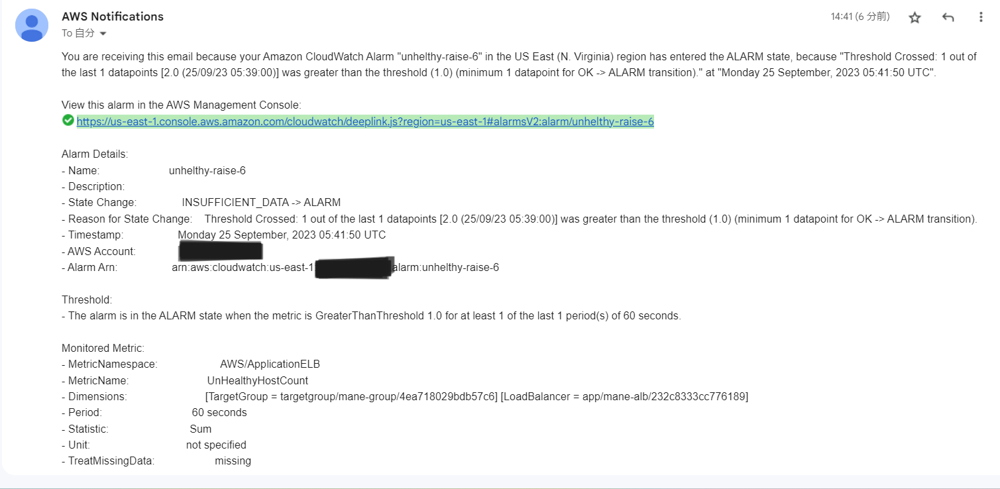
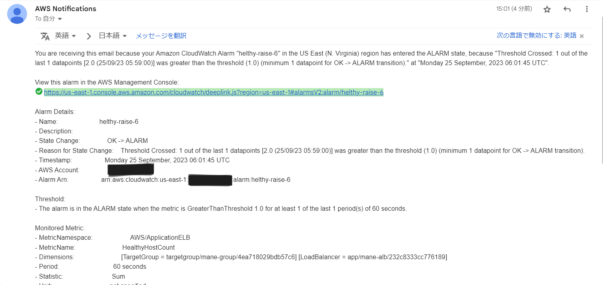
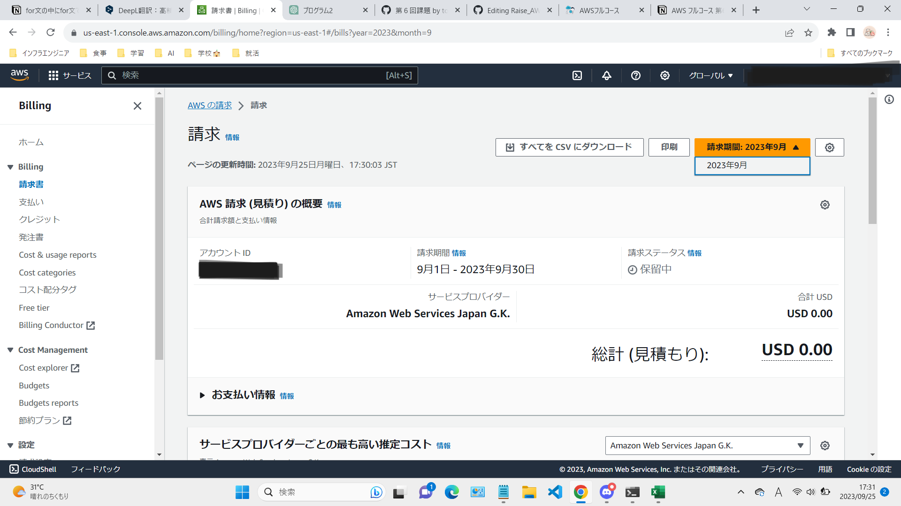

## CloudTrailのイベント
[DeleteBucket]

・eventTime: 2023-09-25T03:22:59Z

・requestID: RMK08G9X10GVY762

・eventType: AwsApiCall

## ALBのアラームを設定して、メール通知
### Railsアプリケーション停止時(Unhealthy)

### Railsアプリケーション起動時(healthy)

## AWS利用料の見積

https://calculator.aws/#/estimate?id=e5c466dd94717dfa5dac9ab4c4d7656019fbf163

## AWSの請求情報
### AWSアカウントの利用は今月からで先月の情報がないため、今月の保留中の請求情報を以下に載せます

## EC2の請求情報
### EC2の請求額はUSD 0.00で、現在は無料利用枠の範囲である750時間/月に収まっている。

